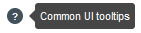
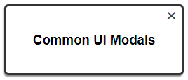
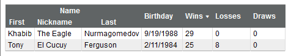

# Web Common #

Web Common is a collection of polyfills, extensions, and modules I repeatedly found myself reapplying on new projects.

Lawrence Sim © 2023

## License ##

*Permission is hereby granted, free of charge, to any person obtaining a copy of this software and associated documentation files (the "Software"), to deal in the Software without restriction, including without limitation the rights to use, copy, modify, merge, publish, distribute, sublicense, and/or sell copies of the Software, and to permit persons to whom the Software is furnished to do so, subject to the following conditions:*

*The above copyright notice and this permission notice shall be included in all copies or substantial portions of the Software.*

*THE SOFTWARE IS PROVIDED "AS IS", WITHOUT WARRANTY OF ANY KIND, EXPRESS OR IMPLIED, INCLUDING BUT NOT LIMITED TO THE WARRANTIES OF MERCHANTABILITY, FITNESS FOR A PARTICULAR PURPOSE AND NONINFRINGEMENT. IN NO EVENT SHALL THE AUTHORS OR COPYRIGHT HOLDERS BE LIABLE FOR ANY CLAIM, DAMAGES OR OTHER LIABILITY, WHETHER IN AN ACTION OF CONTRACT, TORT OR OTHERWISE, ARISING FROM, OUT OF OR IN CONNECTION WITH THE SOFTWARE OR THE USE OR OTHER DEALINGS IN THE SOFTWARE.*

## Content ##

* [Usage](#usage)
* [Polyfills](#polyfills)
    * [Promises](#promises)
* [Global Browser Variable](#global-browser-variable)
* [Prototype Modifications](#prototype-modifications)
* [Date (UTC) Modifications](#date-utc-modifications)
* [Common](#common-object)
* [Common UI](#common-ui)
    * [Tooltips and Help Icons](#tooltips--help-icons)
    * [Modal Dialogs](#modal-dialogs)
* [CommonTable](#commontable-class)
* [Acknowledgments](#acknowledgments)

## Usage ##

Installation is best handled via NPM:

`npm install @lawrencesim/web-common`

Libraries can be imported with ES6 syntax as follows:

```javascript
import common from '@lawrencesim/web-common';
import '@lawrencesim/web-common/style.css';
import CommonTable from '@lawrencesim/web-common/CommonTable';
```

The first import will bring in the common module, including polyfills/extensions, and the UI submodule. If using the UI submodule or CommonTable module, you will also need to load the styles (second line), but otherwise, this can be left out. Note that depending on build configuration (e.g. Webpack) you may need proper style handlers to load the CSS styles. The final line loads the optional CommonTable class.

If using script imports in HTML, import the paths to 'common.js', 'style.css', and/or 'CommonTable.js' as needed in the main directory. The main module will be added as `common` and CommonTable as `CommonTable` to the global namespace.

&nbsp;

#### Version 5 Breaking Changes ####

* *String*.prototype.**heuristicCompare**() is removed. Use *String*.prototype.[**semanticCompare**()](#common-stringSemanticCompare) instead.
* *common*.[**extend**()](#common-extend), parameters are renamed `overwrite`, `deep`, and `modify` from `allowOverwrite`, `deepCopy`, and `modifyObj`. While detection is still left in for older names for backwards compatibility, it may be deprecated at some point.
* *common*.[**newWindow**()](#common-newWindow) no longer accepts flat parameters. All parameters except for `url` (and optoinally `name`) must be specified in an options object.
* *common*.[**animate**()](#common-animate), parameters are renamed `duration` and `timing` from `durationMs`, and `timingFunction`. While detection is still left in for older names for backwards compatibility, it may be deprecated at some point.

&nbsp;

## Polyfills ##

Ensures the below functions exists, many of which are missing in Internet Explorer (pre-Edge) and Opera Mini.

Note that this is just a personal list of functions I tended to require (combined with a history of having to work with gov't clients that were still stuck in IE land). These days, probably less necessary, and if so, better to use a more complete polyfill library like [core-js](https://www.npmjs.com/package/core-js).

<a name="common-arrayFrom" href="#common-arrayFrom">#</a>
*Array*.**from**(*arrayLike*[, *mapFn*[, *thisArg*]])

Create array from array-like or iterable.

See [https://developer.mozilla.org/en-US/docs/Web/JavaScript/Reference/Global_Objects/Array/from](https://developer.mozilla.org/en-US/docs/Web/JavaScript/Reference/Global_Objects/Array/from)

<a name="common-arrayFind" href="#common-arrayFind">#</a>
*Array*.prototype.**find**(*callback*[, *thisArg*])

Find item in an array. 

See [https://developer.mozilla.org/en-US/docs/Web/JavaScript/Reference/Global_Objects/Array/find](https://developer.mozilla.org/en-US/docs/Web/JavaScript/Reference/Global_Objects/Array/find)

<a name="common-arrayFindIndex" href="#common-arrayFindIndex">#</a>
*Array*.prototype.**findIndex**(*callback*[, *thisArg*])

Find index of an item in an array. 

See [https://developer.mozilla.org/en-US/docs/Web/JavaScript/Reference/Global_Objects/Array/findIndex](https://developer.mozilla.org/en-US/docs/Web/JavaScript/Reference/Global_Objects/Array/findIndex)

<a name="common-arrayFindLast" href="#common-arrayFindLast">#</a>
*Array*.prototype.**findLast**(*callback*[, *thisArg*])

Find item in an array, searching in reverse.

See [https://developer.mozilla.org/en-US/docs/Web/JavaScript/Reference/Global_Objects/Array/findLast](https://developer.mozilla.org/en-US/docs/Web/JavaScript/Reference/Global_Objects/Array/findLast)

<a name="common-arrayFindLastIndex" href="#common-arrayFindLastIndex">#</a>
*Array*.prototype.**findLastIndex**(*callback*[, *thisArg*])

Find index of an item in an array, searching in reverse.

See [https://developer.mozilla.org/en-US/docs/Web/JavaScript/Reference/Global_Objects/Array/findLastIndex](https://developer.mozilla.org/en-US/docs/Web/JavaScript/Reference/Global_Objects/Array/findLastIndex)

<a name="common-arrayFlat" href="#common-arrayFlat">#</a>
*Array*.prototype.**flat**([*depth*])

Flatten an array to a desired depth (or default single-depth).

See [https://developer.mozilla.org/en-US/docs/Web/JavaScript/Reference/Global_Objects/Array/flat](https://developer.mozilla.org/en-US/docs/Web/JavaScript/Reference/Global_Objects/Array/flat)

<a name="common-arrayIncludes" href="#common-arrayIncludes">#</a>
*Array*.prototype.**includes**(*searchElement*[, *fromIndex*])

Find if an item exists in an array. 

See [https://developer.mozilla.org/en-US/docs/Web/JavaScript/Reference/Global_Objects/Array/includes](https://developer.mozilla.org/en-US/docs/Web/JavaScript/Reference/Global_Objects/Array/includes)

<a name="common-elementRemove" href="#common-elementRemove">#</a>
*Element*.prototype.**remove**()

Remove element. 

See [https://developer.mozilla.org/en-US/docs/Web/API/ChildNode/remove](https://developer.mozilla.org/en-US/docs/Web/API/ChildNode/remove)

<a name="common-elementAppend" href="#common-elementAppend">#</a>
*Element*.prototype.**append**(*nodes*)

Append to element. 

See [https://developer.mozilla.org/en-US/docs/Web/API/ParentNode/append](https://developer.mozilla.org/en-US/docs/Web/API/ParentNode/append)

<a name="common-elementPrepend" href="#common-elementPrepend">#</a>
*Element*.prototype.**prepend**(*nodes*)

Prepend to element. 

See [https://developer.mozilla.org/en-US/docs/Web/API/ParentNode/prepend](https://developer.mozilla.org/en-US/docs/Web/API/ParentNode/prepend)

<a name="common-elementMatches" href="#common-elementMatches">#</a>
*Element*.prototype.**matches**(*selectors*)

Check if element matches selector. 

See [https://developer.mozilla.org/en-US/docs/Web/API/Element/matches](https://developer.mozilla.org/en-US/docs/Web/API/Element/matches)

<a name="common-elementCloset" href="#common-elementCloset">#</a>
*Element*.prototype.**closest**(*selectors*)

Find closest element matching selector. 

See [https://developer.mozilla.org/en-US/docs/Web/API/Element/closest](https://developer.mozilla.org/en-US/docs/Web/API/Element/closest)

<a name="common-elementClassList" href="#common-elementClassList">#</a>
*Element*.**classList** 

Ensures existence of `contains()`, `add()`, `remove()`, `toggle()`, and `replace()` functions in element's `classList` property. 

See [https://developer.mozilla.org/en-US/docs/Web/API/Element/classList](https://developer.mozilla.org/en-US/docs/Web/API/Element/classList)  

Note that IE and Edge cannot support `classList` on SVG elements (no polyfill available).

<a name="common-nodeListForEach" href="#common-nodeListForEach">#</a>
*NodeList*.prototype.**forEach**(*callback*[, *thisArg]*)

Functionally iterate through a `NodeList`. 

See [https://developer.mozilla.org/en-US/docs/Web/API/NodeList/forEach](https://developer.mozilla.org/en-US/docs/Web/API/NodeList/forEach)

<a name="common-stringStartsWith" href="#common-stringStartsWith">#</a>
*String*.prototype.**startsWith**(*searchString*[, *position*])

Check string starts with sequence. 

See [https://developer.mozilla.org/en-US/docs/Web/JavaScript/Reference/Global_Objects/String/startsWith](https://developer.mozilla.org/en-US/docs/Web/JavaScript/Reference/Global_Objects/String/startsWith)

<a name="common-stringEndsWith" href="#common-stringEndsWith">#</a>
*String*.prototype.**endsWith**(*searchString*[, *length*])

Check string ends with sequence. 

See [https://developer.mozilla.org/en-US/docs/Web/JavaScript/Reference/Global_Objects/String/endsWith](https://developer.mozilla.org/en-US/docs/Web/JavaScript/Reference/Global_Objects/String/endsWith)

<a name="common-stringRepeat" href="#common-stringRepeat">#</a>
*String*.prototype.**repeat**(*count*)

Repeat string content. 

See [https://developer.mozilla.org/en-US/docs/Web/JavaScript/Reference/Global_Objects/String/repeat](https://developer.mozilla.org/en-US/docs/Web/JavaScript/Reference/Global_Objects/String/repeat)

&nbsp;

### Promises ###

Internally, [taylorhakes/promise-polyfill](https://github.com/taylorhakes/promise-polyfill) is called, if necessary, to polyfill for [Promises](https://developer.mozilla.org/en-US/docs/Web/JavaScript/Reference/Global_Objects/Promise). However, it is only used locally and not added to the global namespace. As it's very lightweight (and I don't want to simply wrap/repackage Taylor's work), I recommend installing his library directly to your projects if you need a polyfill for Promises. Thus, if you think you will need to polyfill for Promises, bring in this library to your dependencies or else a error will occur when using [*common*.**ajax**()](#common-ajax) or [*common*.**animate**()](#common-animate) in a browser without support for Promises.

&nbsp;

## Global Browser Variable ##

Two variables are added to the `window` namespace (if it exists) that stores browser information.

| Param | Description |
| --- | :--- |
| `browser` | Stores information on browser type and version. |
| `browserType` |  Alias for `browser`, left for backwards compatibility. |

Note there are two formats in which data exists as browser information. One is a simple string parse of the UserAgent and version as key name and value. For certain user agents this may return multiple results. However there may exist a secondary `is-` variable, which is heuristically determined, that will give the specific browser.

E.g. for Opera browsers, with an example user agent of `"Mozilla/5.0 (Windows NT 10.0; WOW64; x64) AppleWebKit/537.36 (KHTML, like Gecko) Chrome/88.0.4324.150 Safari/537.36 OPR/74.0.3911.75"`, the `browser` object will show three separate browser versions and an `isOpera` variable:

```javascript
{
  chrome: 88, 
  safari: 537, 
  opera: 74, 
  isOpera: true
}
```

Similarly, the variable might be `isChrome` or `isFirefox` or `isEdge`, as the case dictates.

Currently, this checks for the following known browsers: Chrome, Firefox, Edge, IE, Safari, Opera, Brave, Samsung Internet, UCBrowser, Yandex, 360 Secure Browser, QQBrowser, Instabridge, Vivaldi, Cốc Cốc, Naver Whale, Puffin, Sleipnir, Amazon Silk, and QtWebEngine. 

For browsers on iOS – which Apple forces to be basically skins of Safari Mobile – these may not always be identified correctly as Safari some browser don't change the user agent name. For what it's worth, Chrome, Firefox, and Edge flavors will have versions under `crios`, `fiox`, and `edgios` while correctly identifying it as a Safari Browser.

Note that this method of parsing the UserAgent string is somewhat brittle and can be unreliable, especially for those lesser-seen browsers or those specific to devices (like tablets, smart TVs, or gaming consoles). If this is critical, it is generally preferred to use feature detection instead.

&nbsp;

## Prototype Modifications ##

These useful functions are added to common object prototypes.

<a name="common-arrayGetOverlaps" href="#common-arrayGetOverlaps">#</a>
*Array*.**getOverlaps**(*a*, *b*) ⇒ `Array`<br />
<a name="common-arrayGetOverlaps" href="#common-arrayGetOverlaps">#</a>
*Array*.prototype.**getOverlaps**(*arr*) ⇒ `Array`

Get overlapping values with second array. Can be called from array instance or `Array` global. Uses strict equality.

<a name="common-arrayOverlaps" href="#common-arrayOverlaps">#</a>
*Array*.**overlaps**(*a*, *b*) ⇒ `boolean`<br />
<a name="common-arrayOverlaps" href="#common-arrayOverlaps">#</a>
*Array*.prototype.**overlaps**(*arr*) ⇒ `boolean`

Check if at least one value overlaps with second array. Can be called from array instance or `Array` global. Uses strict equality.

<a name="common-arrayRemove" href="#common-arrayRemove">#</a>
*Array*.prototype.**remove**(*value*[, *index*[, *limit*]]) ⇒ `Array`

Remove all instances of a value from an array. Value matching uses strict equality. Creates a copy of the array without modifying the original array.

Set `index` to define the index at which to start indexing. Negatives are allowed to find a position from reverse. If the index is greater than or equal to the length of the array, the array is not searched and nothing is removed.

Set `limit` to a positive value to define a limit to the number of times the value will be removed. Otherwise, the removal allowance is unlimited.

<a name="common-elementIsVisible" href="#common-elementIsVisible">#</a>
*Element*.prototype.**isVisible**() ⇒ `boolean`

Check is element is visible. Uses `getBoundingClientRect` method, which is more reliable than the old `offsetParent` trick.

<a name="common-elementSetAttributes" href="#common-elementSetAttributes">#</a>
*Element*.prototype.**setAttributes**(*attrs*)

Sets multiple attributes (given as a dictionary-like object of key-value pairs) at once.

<a name="common-elementCss" href="#common-elementCss">#</a>
*Element*.prototype.**css**(*style*[, *value*])

Much like the JQuery css() function, sets inline style, either as style name and value provided as strings, or as a dictionary-like object of style names and values and key-value pairs. 

<a name="common-elementCenter" href="#common-elementCenter">#</a>
*Element*.prototype.**center**()

Will center an element on screen using absolute positioning.

<a name="common-elementAddCommas" href="#common-elementAddCommas">#</a>
*Number*.prototype.**addCommas**(*precision*) ⇒ `string`

Will convert a given number to a string, using the supplied precision, with commas.

<a name="common-elementAddCommasSmart" href="#common-elementAddCommasSmart">#</a>
*Number*.prototype.**addCommasSmart**([*minimum=0.001*, [*zeroFormat="0.0"*]) ⇒ `string`

Basically wraps `Number.prototype.addCommas()` with heuristic guessing on precision to use. The `minimum` parameter rounds any value whose absolute value is less than this to zero. The `zeroFormat` parameter can be used to customize how zero values are printed. By default it is "0.0".

Current heuristics are: 

* Evaluation to zero is always written in the zero format (default "0.0")
* \<0.01 as scientific notation with three significant figures
* \<0.1 as scientific notation with two significant figures
* \<0.3 as number with three decimal places
* \<1.0 as number with two decimal places
* \<100 as number with one decimal place
* ≥100 as number with no decimal places

<a name="common-objectIsObject" href="#common-objectIsObject">#</a>
*Object*.**isObject**(*obj*) ⇒ `boolean`

Check is given object is an object-type. That is, not a primitive, string, or array. This includes any inheritance of the object prototype, except for arrays.

Uses [`typeof`](https://developer.mozilla.org/en-US/docs/Web/JavaScript/Reference/Operators/typeof) check with extra handling to invalidate array types.

<a name="common-objectIsObjectLiteral" href="#common-objectIsObjectLiteral">#</a>
*Object*.**isObjectLiteral**(*obj*) ⇒ `boolean`

Check is given object is an object literal-type. That is, not a primitive, string, array, or even any inheritance of the Object prototype. Must be a base object created either as an object literal  or via `new Object()`. Useful for when parameters must be ensured as an object-literal/dictionary.

Uses [`Object.getPrototypeOf()`](https://developer.mozilla.org/en-US/docs/Web/JavaScript/Reference/Global_Objects/Object/getPrototypeOf) check.

<a name="common-stringCapitalize" href="#common-stringCapitalize">#</a>
*String*.prototype.**capitalize**([*breaks*]) ⇒ `string`

Will capitalize the each word in the string (using whitespace to delineate words). 

Additional break characters can be provided as either an array of characters or a string of all characters in the optional parameter `breaks`. E.g., to include hyphens, `"up-to-date".capitalize("-")` will output `Up-To-Date`.

<a name="common-stringSemanticCompare" href="#common-stringSemanticCompare">#</a>
*String*.prototype.**semanticCompare**(*compareString*[, *options*]) ⇒ `number`

A semantic comparison of strings with numeric values within them. Compare the numbers in a string such that a "number" is not compared alphabetically by character but as the entire numeric value. 

E.g., a typical string comparisons would result in '20' coming before '5', because it was compare character by character, first comparing the '2' and '5' characters. This ensures, the entire '20' is considered as one number.

Returns numeric indicating whether `this` string comes before (-1), after (1), or is equal (0) to compared string. As such, can be inserted into most sort functions such as [Array.prototype.sort()](https://developer.mozilla.org/en-US/docs/Web/JavaScript/Reference/Global_Objects/Array/sort) within the compare function.


```javascript
"x01x02".semanticCompare("x1x2");  //  0 is semantically equal
"x20".semanticCompare("x1");       //  1 comes after
"x9".semanticCompare("x999");      // -1 comes before
"b1".semanticCompare("a2");        //  1 comes after
```

Each string is broken into chunks of parsable number and non-numeric chunks. Each chunk is compared in similar sequences. When both compared chunks are parsable numbers, they will be compared numerically. If either is not, they will be compared as strings. E.g. "a10bc40" and "a10b50c" would be broken up into `['a', '10', 'bc', '40']` and `['a', '10', 'b', '50', 'c']` respectively. The crux of the comparison would happen at the chunks "bc" vs "b" (wherein "b" comes before "bc"), and the comparison of chunks "40" and "50" would be irrelevant.

```javascript
"a10bc40".semanticCompare("a10b50c");  // 1
```

By default, negative numbers and decimals are not handled as dashes and periods may not be considered part of the number, depending on the string. This can be switched by setting true either/both the optional parameters `options.handleNegative` and/or `options.handleDeciaml`. If enabling decimals in particular, ensure numbers are properly formatted. E.g. a value of "3.2.1" would result in a numeric parsing two separate values of "3.2" and "0.1".

```javascript
"x-2".semanticCompare("x-1");  // 1
"x-2".semanticCompare("x-1", {handleNegative: true});  // -1
```

&nbsp;

## Date (UTC) Modifications ##

Additional functions for handling basic Date objects are added. Specifically to ensure UTC handling.

<a name="common-DateUTC" href="#common-DateUTC">#</a>
**DateUTC**(*year*, *month*, *day*[, *hour*[, *min*[, *sec*]]]) ⇒ `Date`

Creates a datetime, forced as UTC. **Month is to be indicated as number from 1-12** (unlike traditional Date constructor as 0-11).

<a name="common-dateAsUTC" href="#common-dateAsUTC">#</a>
*Date*.prototype.**asUTC**() ⇒ `Date`

Converts datetime to UTC assuming time given (assumed localtime) was actually meant as UTC time. That is to say, Does not convert localtime to UTC and simply passes the time values as they exist. The date/time in localtime will be kept as the UTC date/time, only changing the timezone to UTC.

```javascript
d = new Date(2019, 0, 1, 20);  // Tue Jan 01 2019 20:00:00 GMT-0800 (Pacific Standard Time)
d.asUTC();                     // Tue Jan 01 2019 12:00:00 GMT-0800 (Pacific Standard Time)
```

In the above conversion, assumed the date of Jan 1 2019 at 20:00 was meant as UTC and adjust the timezone without converting the time. When printing the date, which in javascript is by default converted to localtime (in this case PST), it 8 hours earlier but corresponds to 20:00 UTC.

<a name="common-dateToUTC" href="#common-dateToUTC">#</a>
*Date*.prototype.**toUTC**() ⇒ `Date`

Creates new `DateUTC` using the UTC datetime of this object, converted from localtime.

```javascript
d = new Date(2019, 0, 1, 20);  // Tue Jan 01 2019 20:00:00 GMT-0800 (Pacific Standard Time)
d.toUTC();                     // Tue Jan 01 2019 20:00:00 GMT-0800 (Pacific Standard Time)
```

As printing is always done in localtime, conversion is mostly symbolic. This function only left in for completeness, but really doesn't do anything.

<a name="common-dateAsUTCDate" href="#common-dateAsUTCDate">#</a>
*Date*.prototype.**asUTCDate**() ⇒ `Date`

Converts date by dropping any time information and assuming 12:00 AM UTC. Does not convert localtime to UTC and simply passes the time values as they exist.

```javascript
d = new Date(2019, 0, 1, 20);  // Tue Jan 01 2019 20:00:00 GMT-0800 (Pacific Standard Time)
d.asUTCDate();                 // Mon Dec 31 2018 16:00:00 GMT-0800 (Pacific Standard Time)
```

In the above conversion, converts Jan 1, 2019 (date-only) in UTC time (though constructed with localtime). Drops time information, making it Jan 1, 2019 at 00:00 UTC. Printed, which is in localtime by default in javascript, it shows as 16:00 PST the previous day.

<a name="common-dateToUTCDate" href="#common-dateToUTCDate">#</a>
*Date*.prototype.**toUTCDate**() ⇒ `Date`

Converts date by first converting the time to UTC, then dropping any time information and assuming 12:00 AM UTC.

```javascript
d = new Date(2019, 0, 1, 20);  // Tue Jan 01 2019 20:00:00 GMT-0800 (Pacific Standard Time)
d.toUTCDate();                 // Tue Jan 01 2019 16:00:00 GMT-0800 (Pacific Standard Time)
```

In the above conversion, first converts Jan 1, 2019 at 20:00 in PST to 04:00 UTC the following day. Then it drops time information, making it Jan 2, 2019 at 00:00 UTC. Printed, which is in localtime by default in javascript, it shows as 16:00 PST the previous day (which is still Jan 1).

<a name="common-dateAddDays" href="#common-dateAddDays">#</a>
*Date*.prototype.**addDays**(*days*) ⇒ `Date`

Returns new date with days added (or removed if negative).

<a name="common-dateMonthOfYear" href="#common-dateMonthOfYear">#</a>
*Date*.prototype.**monthOfYear**() ⇒ `number`

Returns the month of the year as 1-12 number (as opposed to 0-11 for `getMonth()`).

<a name="common-dateDaysInMonth" href="#common-dateDaysInMonth">#</a>
*Date*.prototype.**daysInMonth**() ⇒ `number`

Returns number of days in the month for this date.

&nbsp;

## Common Object ##

Returned as object if instantiated via CommonJS or AMD import. Otherwise appended to root as common (e.g. `window.common`).
 
<a name="common-getElement" href="#common-getElement">#</a>
*common*.**getElement**(*element*) ⇒ `Element`

Given an input, returns an [Element](https://developer.mozilla.org/en-US/docs/Web/API/Element) (or object derived from the Element prototype) as best determined from what is provided.

| Param | Type | Description |
| :--- | :---: | :--- |
| element | `Element` \| `jQuery` \| `String` | Object to convert to `Element`. |

If a single Element is provided, simply returns it. If an array is provided, returns the first item (or `undefined` if empty). If a NodeList or other iterable is provided, returns value of `next()` or `null` if done. If a jQuery object is provided, returns the first result in [`get()`](https://api.jquery.com/get/), or `null` if no results. If string is provided, returns result of [`document.querySelector()`](https://developer.mozilla.org/en-US/docs/Web/API/Document/querySelector) using the string as the selector. If none of the above apply, returns `null`.

&nbsp; &nbsp; **Returns:** The `Element` instance found by the function, or null.

<a name="common-getElementList" href="#common-getElementList">#</a>
*common*.**getElementList**(*input*) ⇒ `Element[]`

Given an input, converts it into an array of [Elements](https://developer.mozilla.org/en-US/docs/Web/API/Element) (or objects derived from the Element prototype).

| Param | Type | Description |
| :--- | :---: | :--- |
| input | `Element` \| `NodeList` \| `jQuery` \| `String` | Object to convert to array or `NodeList`. |

Specifics on function behavior is based on the type of `input`.

* If a NodeList, array, or other iterable is provided, converts to an array via `Array.from()`, then filters for elements that are derived from the Element prototype. 
* If a `jQuery` object is provided, returns array given by calling [`get()`](https://api.jquery.com/get/) on it. 
* If a string is provided, returns result of [`document.querySelectorAll()`](https://developer.mozilla.org/en-US/docs/Web/API/Document/querySelectorAll), using the string as the selector, converted into an array. 
* Otherwise, wraps the input in an array, then filters for elements that are derived from the Element prototype.

&nbsp; &nbsp; **Returns:** An `Array` of `Element` instances found by the function.

<a name="common-extend" href="#common-extend">#</a>
*common*.**extend**(*obj*, *extend*[, *options*]) ⇒ `Object`<br />
<a href="#common-extend">#</a>
*common*.**extend**(*obj*, *extend*[, *overwrite*[, *deep*[, *modify*]]]) ⇒ `Object`

Copy given object and extended with new values. The passed objects are not modified in any way unless `modify` is set true.

| Param | Type | Description |
| :--- | :---: | :--- |
| obj | `Object` | Base object. |
| extend | `Object` | Object of extensions to the copy of the base object. |
| options | `Object` | Options object, or options may be specified in flat series of parameters. |
| options.overwrite | `Boolean` | Unless true, items in `extend` matching existing values in `obj` by key are not copied over. |
| options.allowOverwrite | `Boolean` | Same as above. |
| options.deep | `Boolean` | If true, all values are copied via `structuredClone()` or, as a fallback, `JSON.parse(JSON.stringify())`. |
| options.deepCopy | `Boolean` | Same as above. |
| options.modify | `Boolean` | If true, the input base object (`obj`) is modified directly, instead of cloning. |
| options.modifyObj | `Boolean` | Same as above. |

If either `extend` or `obj` is null or undefined (or evaluates as such, e.g. false or zeros values), a copy of whatever remaining object is returned. Otherwise, values in `obj` and `extend` are copied to a cloned object by passing the value. Thus primitive types are copied by value, but objects will be copied by reference, unless `deepCopy` is true.

In the case that the value being copied from and the value being copied over are both object literals, the copying will be recursed into the next level for each the origin and extending object.

Deep copy is done via [`structuredClone()`](https://developer.mozilla.org/en-US/docs/Web/API/structuredClone), if available, or fallbacks to the `JSON.parse(JSON.stringify())` method. Note that the former method may throw an `DataCloneError` exception and the latter will results in some values (such as dates, functions, or circular references) not being correctly carried over.

&nbsp; &nbsp; **Returns:** The new, extended object (or, if `modify` is true, a reference to the same original object, which has been changed).

<a name="common-getUrlGetVars" href="#common-getUrlGetVars">#</a>
*common*.**getUrlGetVars**() ⇒ `Object`

Retrieve GET parameters in current URL as an object literal (dictionary format).

&nbsp; &nbsp; **Returns:** Object literal of GET parameters found in URL.

<a name="common-newWindow" href="#common-newWindow">#</a>
*common*.**newWindow**(*url*[, *options*]) ⇒ `WindowProxy`<br />
<a href="#common-newWindow">#</a>
*common*.**newWindow**(*url*, *name*[, *options*]) ⇒ `WindowProxy`

Creates a new, centered window.

| Param | Type | Description |
| :--- | :---: | :--- |
| url | `String` | URL for new window or an object literal with all parameters as properties. |
| name | `String` | New window name. |
| options | `Object` | |
| options.name | `String` | New window name may also be specified in the options. |
| options.width | `Number` | Width in pixels. If not specified, defaults to 600. |
| options.height | `Number` | Height in pixels. If not specified, defaults to 400. |
| options.minimal | `Boolean` | Optional. If true forces hiding of menubar, statusbar, and location – although with many modern browsers this has no effect as it is not allowed. |
| options.options | `Object` | Optional. Additional window options (passed as `windowFeatures` parameter). Specify as key-value pairing. Will overwrite any options set by function or other parameters. |
| options.error | `Callback` | Optional. Callback to run when the new window is detected to have been immediately closed (likely due to pop-up blocking). Given the `WindowProxy` object returned by `window.open()`. |

&nbsp; &nbsp; **Returns:** The [`WindowProxy`](https://developer.mozilla.org/en-US/docs/Glossary/WindowProxy) object returned by `window.open()`.

<a name="common-ajax" href="#common-ajax">#</a>
*common*.**ajax**(*params*) ⇒ `XMLHttpRequest` | `Promise`

Mimics [jQuery.ajax()](http://api.jquery.com/jQuery.ajax/) function call with `XMLHttpRequest`.

However, if the project allows, I'd nowadays recommend using the [Fetch API](https://developer.mozilla.org/en-US/docs/Web/API/Fetch_API) instead (if needed, a [polyfill](https://github.com/github/fetch) is also available as `whatwg-fetch` in NPM).

| Param | Type | Default | Description |
| :--- | :---: | :---: | :--- |
| params.url | `String` |  | The URL of the request. |
| params.async | `Boolean` | `true` | Asynchronous. Defaults to true. |
| params.method | `String` | `"GET"` | Method for passing data. |
| params.data | `Object` |  | Optional dictionary of data to send with request. |
| params.dataType | `String` |  | Type of returned data. See [XMLHttpRequest.responseType](https://developer.mozilla.org/en-US/docs/Web/API/XMLHttpRequest/responseType). |
| params.success | `Callback` |  | Callback on success. Passes parameters of `XMLHttpRequest.responseText`, `XMLHttpRequest.statusText`, and the `XMLHttpRequest` instance itself. |
| params.error | `Callback` |  | Callback on error. Passes parameters the `XMLHttpRequest` instance, `XMLHttpRequest.statusText`, and `XMLHttpRequest.responseText`. |
| params.complete | `Callback` |  | Callback on completion (whether success or error). Passes parameters the `XMLHttpRequest` instance and `XMLHttpRequest.statusText`. |
| params.user | `String` |  | Optional username, if necessitated. |
| params.password | `String` |  | Optional password, if necessitated. |
| params.promise | `Boolean` |  | Optionally return as Promise that resolves when the request resolves. |

&nbsp; &nbsp; **Returns:** `XMLHttpRequest` or `Promise` on completion for the request.

<a name="common-animate" href="#common-animate">#</a>
*common*.**animate**(*options*) ⇒ `Promise`<br />
<a href="#common-animate">#</a>
*common*.**animate**(*element*, *options*) ⇒ `Promise`<br />
<a href="#common-animate">#</a>
*common*.**animate**(*element*, *properties*[, *options*]) ⇒ `Promise`<br />
<a href="#common-animate">#</a>
*common*.**animate**(*element*, *properties*, *duration*[, *options*]) ⇒ `Promise`


Mimics [jQuery.animate()](http://api.jquery.com/jQuery.animate/) function using CSS transitions by first applying a [transition](https://developer.mozilla.org/en-US/docs/Web/CSS/transition) property for the requisite CSS properties to be applied, then, after a short delay (5 ms), applying the properties. All this is done as modifications to the element's inline styles, and will thus overwrite any existing inline styles and will be subject to any CSS rule overrides (such as an existing, applicable CSS rule with the `!imporant` property).

| Param | Type | Description |
| :--- | :---: | :--- |
| element | `Element` | The Element to animate |
| properties | `Object` | CSS properties to animate to. Note that [not all properties are can be animated](https://developer.mozilla.org/en-US/docs/Web/CSS/CSS_animated_properties). |
| duration | `Number` | Duration of animation, in milliseconds. Optional, but if not supplied, the animation is somewhat pointless as the transition is instant. |
| options | `Object` | |
| options.element | `Element` | The `element` parameter may also be specified in the options. |
| options.properties | `Object` | The `properties` parameter may also be specified in the options. |
| options.duration | `Number` | The `duration` parameter may also be specified in the options. |
| options.durationMs | `Number` | Same as above. |
| options.timing | `String` | Timing/easing function, defaults to "ease". See: [transition-timing-function](https://developer.mozilla.org/en-US/docs/Web/CSS/transition-timing-function). |
| options.timingFunction | `String` | Same as above. |
| options.complete | `Callback` | Optional callback to run on completion. |

&nbsp; &nbsp; **Returns:** A `Promise` tied to the animation duration, if the Promise API is available. Otherwise returns nothing.

&nbsp;

## Common UI ##

Packaged with `common` as `common.ui`.

The Common UI modules allow for some simple, commonly-used UI functionality, mostly through CSS. As such, `common.min.css` is required.

For modal dialog usage, ensure your dependency-manager/import-function is caching requires/imports of the `common` object, or that you are passing the object by reference. Calling multiple instances of `common.ui` in the same window can result in odd behavior for modal management.

<a name="common-addGrabCursorFunctionality" href="#common-addGrabCursorFunctionality">#</a>
*common*.*ui*.**addGrabCursorFunctionality**(*element*)

Adds grab cursor functionality to draggable element. Element may be single element, a NodeList/Array of elements, or a jQuery selection.

Adds class "grab" to element, and class "grabbing" when being dragged.

| Param | Type | Description |
| :--- | :---: | :--- |
| element | `Element` \| `NodeList` \| `jQuery` \| `String` | Element to add functionality to. See [`common.getElementList()`](#common-getElementList) for evaluation of this parameter. |

<a name="common-createDropdown" href="#common-createDropdown">#</a>
*common*.*ui*.**createDropdown**(*element*, *menu*)

Create a dropdown menu on an element. *menu* parameter is an array of object literals defining the menu. The parameters 'id', 'class', 'style', and 'html'/text', if they exist, are applied. For functionality, either add 'href' and optionally 'target' parameters or supply a callback to an 'onClick' parameter. To create a submenu, simply add a 'menu' parameter with the same nested structure. 

Elements with be created with classes prefixed by "cm-dropdown".

| Param | Type | Description |
| :--- | :---: | :--- |
| element | `Element` \| `NodeList` \| `jQuery` \| `String` | Element to add dropdown to. See [`common.getElementList()`](#common-getElementList) for evaluation of this parameter. |
| menu | `Object[]` | JSON map of menu |

*Example usage:*

```javascript
common.ui.createDropdown("#menu", 
  [
    {
      id:      "menu-btn-1", 
      text:    "Homepage", 
      href:    "index.html", 
      style:   {"font-weight": "bold"}, 
      onClick: () => console.log("menu item 1 clicked")
    }, 
    {
      id:    "submenu", 
      text:  "Totally Work Related", 
      style: {"font-style": "italic"}, 
      menu: [
        {text: "Business Stuff", href: "https://facebook.com"},
        {text: "Web Dev. Stuff", href: "https://reddit.com"} 
      ]
    }
  ]
);
```

<a name="common-clearDropdown" href="#common-clearDropdown">#</a>
*common*.*ui*.**clearDropdown**(*element*)

Remove dropdown menu functionality from an element.

| Param | Type | Description |
| :--- | :---: | :--- |
| element | `Element` \| `NodeList` \| `jQuery` \| `String` | Element to remove dropdown from. See [`common.getElementList()`](#common-getElementList) for evaluation of this parameter. |

&nbsp;  

#### Tooltips & help icons ####

The tooltips and help icons functionality can be applied via the functions (described below) or manually.



To add a tooltip manually, add the class `cm-tooltip-left`, `cm-tooltip-top`, `cm-tooltip-right`, or `cm-tooltip-bottom` and the attribute `cm-tooltip-msg` with the tooltip message. To create a help icon, simply create the element `<i>?</i>`, with class `cm-icon`.

<a name="common-addTooltip" href="#common-addTooltip">#</a>
*common*.*ui*.**addTooltip**(*element*, *options*)<br />
<a href="#common-addTooltip">#</a>
*common*.*ui*.**addTooltip**(*element*, *message*[, *direction*[, *force*]])

Add hover tooltip to element(s).

Elements with be created with classes prefixed by "cm-tooltip".

| Param | Type | Description |
| :--- | :---: | :--- |
| element | `Element` \| `NodeList` \| `jQuery` \| `String` | Element to add tooltip to. See [`common.getElementList()`](#common-getElementList) for evaluation of this parameter. |
| options | `Object` | Options object, or options may be specified in flat series of parameters. |
| options.message | `String` | Tooltip message/HTML. |
| options.direction | `String` | Direction of tooltip (defaults to top). |
| options.force | `Boolean` | If true, forces tooltip visible. |

<a name="common-removeTooltip" href="#common-removeTooltip">#</a>
*common*.*ui*.**removeTooltip**(*element*)

Remove hover tooltip from element(s).

| Param | Type | Description |
| :--- | :---: | :--- |
| element | `Element` \| `NodeList` \| `jQuery` \| `String` | Element to remove tooltip from. See [`common.getElementList()`](#common-getElementList) for evaluation of this parameter. |

<a name="common-appendHelpIcon" href="#common-appendHelpIcon">#</a>
*common*.*ui*.**appendHelpIcon**(*element*, *options*)<br />
<a href="#common-appendHelpIcon">#</a>
*common*.*ui*.**appendHelpIcon**(*element*, *message*[, *direction*[, *style*[, *force*]]])

Add help icon to element(s) as (?) styled icon with tooltip.

Icon element will be created with class "cm-icon".

| Param | Type | Description |
| :--- | :---: | :--- |
| element | `Element` \| `NodeList` \| `jQuery` \| `String` | Element to add help icon too. See [`common.getElementList()`](#common-getElementList) for evaluation of this parameter. |
| options | `Object` | Options object, or options may be specified in flat series of parameters. |
| options.message | `String` | Tooltip message/HTML. |
| options.direction | `String` | Direction of tooltip (defaults to top). |
| options.style | `Object` | Dictionary of inline style key-values for icon. |
| options.force | `Boolean` | If true, forces tooltip visible. |
 
<a name="common-removeHelpIcon" href="#common-removeHelpIcon">#</a>
*common*.*ui*.**removeHelpIcon**(*element*)

Remove help icon from element(s).

| Param | Type | Description |
| :--- | :---: | :--- |
| element | `Element` \| `NodeList` \| `jQuery` \| `String` | Element to remove help icon from. See [`common.getElementList()`](#common-getElementList) for evaluation of this parameter. |

&nbsp;  

#### Modal dialogs ####

For modal dialog usage, ensure your dependency-manager/import-function is caching requires/imports of the `common` object, or that you are passing the object by reference. Calling multiple instances of `common.ui` in the same window can result in odd behavior for modal management.



Model elements will be created with classes prefixed by "cm-modal".

When a modal function is first called, this library appends a hidden div to `body` to handle modals/dialogs. This includes a container div (`#cm-modal-container`), an outer modal div (`#cm-modal-outer`) with absolute positioning, and an inner div (`.cm-modal-inner`) which represents the actual dialog. You may (and are in fact recommended to) tweak the CSS rules attached to these as necessary.

Only one modal may be open at a time. Opening another modal will replace the current one.

<a name="common-isModalOpen" href="#common-isModalOpen">#</a>
*common*.*ui*.**isModalOpen**() ⇒ `boolean`

Check whether modal is open.

<a name="common-setModal" href="#common-setModal">#</a>
*common*.*ui*.**setModal**(*visible*, *content*[, *options*]) ⇒ `Element`<br />
<a name="common-setModal" href="#common-setModal">#</a>
*common*.*ui*.**openModal**(*content*[, *options*]) ⇒ `Element`

Creates a new modal dialog (or closes, if visible=false). Function `openModal()` is the same with `visible` defaulted to `true`.

| Param | Type | Description |
| :--- | :---: | :--- |
| visible | `Boolean` | Whether to open or close modal |
| content | `String` | Modal content HTML |
| options | `Object` |  |
| options.id | `String` | Id of inner modal dialog element. |
| options.showBackground | `Boolean` | If true, creates a semi-transparent background over window. |
| options.notExitable | `Boolean` | Normally modal closes on clicking anywhere outside modal dialog element. If true, this prevents this functionality. |
| options.hideCloser | `Boolean` | If true, does not apply the automatically placed "X" to close dialog on upper-right. |
| options.onClose | `Callback` | Callback to run on modal being closed.  |

&nbsp; &nbsp; **Returns:** `Element` of modal content div (`.cm-modal-inner`).

<a name="common-setModalAsLoading" href="#common-setModalAsLoading">#</a>
*common*.*ui*.**setModalAsLoading**([*content*[, *options*]]) ⇒ `Element`

Creates a new modal dialog with default values prepped for loading. `content` is optional and defaults to `"Loading.."`. In addition to same `options` available for [`common.setModal()`](#common-setModal), extended `options` are:

| Param | Type | Default | Description |
| :--- | :---: | :---: | :--- |
| content | `String` | `"Loading.."` | Modal content HTML |
| options | `Object` |  |
| options.id | `String` | `"modal-loading-dialog"` | Id of inner modal dialog element. |
| options.showBackground | `true` | `Boolean` | If true, creates a semi-transparent background over window. |
| options.notExitable | `Boolean` | `true` | Normally modal closes on clicking anywhere outside modal dialog element. If true, this prevents this functionality. |
| options.hideCloser | `Boolean` | `true` | If true, does not apply the automatically placed "X" to close dialog on upper-right. |
| options.addDetails | `Boolean` | `true` | If true, adds smaller subtext below the main modal content. |
| options.addDetailsText | `String` | `"Please wait.."` | The content for subtext below the main modal content, if `addDetails` is set true. |

&nbsp; &nbsp; **Returns:** `Element` of modal content div (`.cm-modal-inner`).
 
<a name="common-changeModal" href="#common-changeModal">#</a>
*common*.*ui*.**changeModal**(*content*[, *prepContentCallback*[, *hideCloser*]]) ⇒ `Element`

Change modal dialog content while leaving all other options the same. Keeps the content-size changes from being too jarring when swapping content by adding small CSS animation to fit new size. If there was a custom width/height defined in the modal's style, these will be lost.

| Param | Type | Description |
| :--- | :---: | :--- |
| content | `String` | Modal content HTML |
| prepContentCallback | `Callback` | If some prep work is needed before determining the new dimensions of the modal for size change animation. |
| hideCloser | `Boolean` | Due to HTML refresh, closer will be readded unless this is set to true. |

&nbsp; &nbsp; **Returns:** `Element` of modal content div (`.cm-modal-inner`).

<a name="common-closeModal" href="#common-closeModal">#</a>
*common*.*ui*.**closeModal**([*suppressOnClose*])<br />
<a name="common-closeModal" href="#common-closeModal">#</a>
*common*.*ui*.**hideModal**([*suppressOnClose*])

Hide any currently visible modal.

| Param | Type | Description |
| :--- | :---: | :--- |
| suppressOnClose | `Boolean` | If true, suppresses `onClose` event callback, if one is attached. |

&nbsp;

## CommonTable Class ##

Table handling object which handles data formatting, grouped columns, column sorting, and basic styling.



And example usage script that would result in the table shown above is given at the end of this section

Must be separately imported. Returned as object if instantiated via CommonJS or AMD import. Otherwise appended to root as CommonTable class. Require base Common module to have been imported, as it depends on some the prototype modifications defined there.

To use, begin by creating instance and adding columns with `addColumn()`. The `key` parameter defines how to assign the data to each column. Other parameters allow various style and formatting methods. Once all columns are added, add data and draw the table with `populateTable()`. The data, sent as an array of object literals/dictionaries, is mapped to the columns automatically with the `key` defined for each column.

<a name="CommonTable" href="CommonTable">#</a>
**CommonTable**([*tableId*[, *tableClass*[, *container*]]])

Creates new CommonTable. The table will be given the class of "cm-table", more classes can be appended through the options.

| Param | Type | Description |
| :--- | :---: | :--- |
| tableId | `String` | Table ID |
| tableClass | `String|String[]` | Table classname (use array to add multiple) |
| container | `Element` | Element to append table to |

<a name="CommonTable-appendTo" href="CommonTable-appendTo">#</a>
*CommonTable*.prototype.**appendTo**(*container*)

Appends table to element.

| Param | Type | Description |
| :--- | :---: | :--- |
| container | `Element` | Element to append table in |

<a name="CommonTable-prependTo" href="CommonTable-prependTo">#</a>
*CommonTable*.prototype.**prependTo**(*container*)

Prepends table to element.

| Param | Type | Description |
| :--- | :---: | :--- |
| container | `Element` | Element to prepend table in |

<a name="CommonTable-addColumn" href="CommonTable-addColumn">#</a>
*CommonTable*.prototype.**addColumn**(*options*)

See above.

| Param | Type | Description |
| :--- | :---: | :--- |
| options | `Object` | |
| options.group | `String` | The header group. If not null, used to group two or more headers as subheaders under a banner header (via colspan). |
| options.title | `String` | The title to display the header as. |
| options.key | `String` | The key used to retrieve data from this header. |
| options.format | `Function` | Optional function such that `format(value)`, returns the formatted value for the table cell. Run in try-catch block, so if it fails, simply continues with raw value. |
| options.hdrStyles | `String` \| `Object` | Optional styles to apply to the header. Overrides any colStyles properties. |
| options.colStyles | `String` \| `Object` | Optional styles to apply to every row in this column (including header). If you only want to apply to non-header cells, must override values in hdrStyles. |
| options.onClick | `Function` | Optional onClick listener to add to each cell (excluding header). Callback will be given the entire row's data as the parameter. |
| options.sortable | `Boolean` | Optional flag to set/disable sortable column on this column. By default columns are sortable, so set as false or null to disable. |

Alternatively, the `group`, `title`, and `key` parameters may be split out and provided as individual parameters.

<a name="CommonTable-addColumn-2" href="CommonTable-addColumn-2">#</a>
*CommonTable*.prototype.**addColumn**(*group*, *title*, *key*[, *options*])

See above.

| Param | Type | Description |
| :--- | :---: | :--- |
| group | `String` | The header group. If not null, used to group two or more headers as subheaders under a banner header (via colspan). |
| title | `String` | The title to display the header as. |
| key | `String` | The key used to retrieve data from this header. |
| options | `Object` | |
| options.format | `Function` | Optional function such that `format(value)`, returns the formatted value for the table cell. Run in try-catch block, so if it fails, simply continues with raw value. |
| options.hdrStyles | `String` \| `Object` | Optional styles to apply to the header. Overrides any colStyles properties. |
| options.colStyles | `String` \| `Object` | Optional styles to apply to every row in this column (including header). If you only want to apply to non-header cells, must override values in hdrStyles. |
| options.onClick | `Function` | Optional onClick listener to add to each cell (excluding header). Callback will be given the entire row's data as the parameter. |
| options.sortable | `Boolean` | Optional flag to set/disable sortable column on this column. By default columns are sortable, so set as false or null to disable. |

<a name="CommonTable-createHeaders" href="CommonTable-createHeaders">#</a>
*CommonTable*.prototype.**createHeaders**([*options*])

[Re]draw table. Unlike `populateTable()`, this only redraws the headers (rest of the rows are lost).

| Param | Type | Description |
| :--- | :---: | :--- |
| options | `Object` | |
| options.sortOnKey | `String` | Optional key to sort on. |
| options.ascending | `Boolean` | If sorting, whether ascending or descending order. |

Alternatively, parameters may be expanded out as individual arguments.

<a name="CommonTable-createHeaders-2" href="CommonTable-createHeaders-2">#</a>
*CommonTable*.prototype.**createHeaders**([*sortOnKey*[, *ascending*]])

| Param | Type | Description |
| :--- | :---: | :--- |
| sortOnKey | `String` | Optional key to sort on. |
| ascending | `Boolean` | If sorting, whether ascending or descending order. |

See above.

<a name="CommonTable-populateTable" href="CommonTable-populateTable">#</a>
*CommonTable*.prototype.**populateTable**(*options*)

Populate and [re]draw table.

| Param | Type | Description |
| :--- | :---: | :--- |
| options | `Object` | |
| options.tableData | `Object[]` | Array of objects, representing data by row. Data is not stored to object or dynamically bound in any way. To update table, must be redrawn, passing the updated data array. |
| options.sortOnKey | `String` | Optional key to sort on. |
| options.ascending | `Boolean` | If sorting, whether ascending or descending order. |

Alternatively, parameters may be expanded out as individual arguments.

<a name="CommonTable-populateTable-2" href="CommonTable-populateTable-2">#</a>
*CommonTable*.prototype.**populateTable**(*tableData*[, *sortOnKey*[, *ascending*]]])

See above.

| Param | Type | Description |
| :--- | :---: | :--- |
| tableData | `Object[]` | Array of objects, representing data by row. Data is not stored to object or dynamically bound in any way. To update table, must be redrawn, passing the updated data array. |
| sortOnKey | `String` | Optional key to sort on. |
| ascending | `Boolean` | If sorting, whether ascending or descending order. |

&nbsp;

----------

*Example usage:*

```javascript
var tbl = new CommonTable("my-table-id", "my-table-class");
tbl.appendTo(document.body);

// first three columns under "Name" header group
tbl.addColumn({group: "Name", title: "First", key: "firstName"});
tbl.addColumn({group: "Name", title: "Nickname", key: "nickName"});
tbl.addColumn({group: "Name", title: "Last", key: "lastName"});
// add generic meta-data (to be used later)
tbl.addColumn({
  title:  "Birthday", 
  key:    "birthDate", 
  format: function(val) {
    return (
      (val.getMonth()+1).toString() + "/" 
      + val.getDate().toString() + "/" 
      + val.getFullYear().toString()
    );
  }
});
// other columns
tbl.addColumn({title: "Wins", key: "winCount"});
tbl.addColumn({title: "Losses", key: "lossCount"});
tbl.addColumn({title: "Draws", key: "drawCount"});

var data = [
  {
    firstName: "Tony", 
    nickName:  "El Cucuy", 
    lastName:  "Ferguson", 
    winCount:  25, 
    lossCount: 8, 
    drawCount: 0, 
    birthDate: new DateUTC(1984, 2, 12)
  }, 
  {
    firstName: "Khabib", 
    nickName:  "The Eagle", 
    lastName:  "Nurmagomedov", 
    winCount:  29, 
    lossCount: 0, 
    drawCount: 0, 
    birthDate: new DateUTC(1988, 9, 20)
  }, 
  // etc...
];

tbl.populateTable({
  tableData: data, 
  sortOnKey: "winCount", 
  ascending: false  // sort by wins descending
});
```

----------

### Acknowledgments ###

A huge bulk of this library was built on solutions found through the Mozilla Developers Network, StackOverflow, and many other smart folks. I would also like to thank SFEI, Bill Burr, and coffee. 
